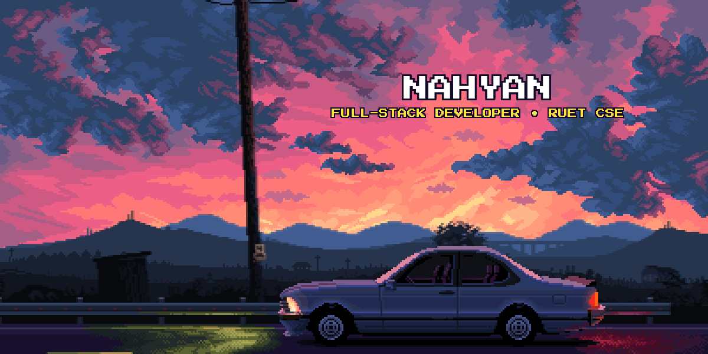

<div align="center">
  <!-- Retro Pixel Art Header with Hovering Pixel Name -->
  

  <br/>

  <!-- Quick Connect & Profile Status Badges -->
  <p align="center">
    <a href="https://www.linkedin.com/in/nahyan-ibtee/" target="_blank" rel="noreferrer">
      
    </a>
    <a href="mailto:ibtee555@gmail.com">
      
    </a>
    <a href="https://github.com/ibtee12">
      
    </a>
    <a href="https://komarev.com/ghpvc/?username=ibtee12&label=Profile%20Views&color=38BDF8&style=for-the-badge">
      
    </a>
  </p>
</div>

---

## 💫 About Me

```yaml
Name: Nahyan (Ibtee)
Location: Rajshahi, Bangladesh 🇧🇩
Education: Computer Science & Engineering (CSE), RUET 🎓
Primary Stack: React, Next.js, Node.js, Express, MongoDB, Tailwind CSS
Passions: Scalable Web Apps, Interactive UI/UX, Computer Vision & Creative Tech
```

- 🎓 **Academic Background:** Undergraduate Computer Science & Engineering (CSE) student at **Rajshahi University of Engineering & Technology (RUET)**.
- 💻 **Engineering Focus:** Building fast, responsive, and production-grade full-stack web applications using **MERN & Next.js**.
- 🚀 **Flagship Deployments:**
  - [**DriveFleet**](https://drivefleet-client.vercel.app) — Modern peer-to-peer car rental and fleet management platform.
  - [**Digital Life Lessons**](https://digital-life-lessons-client-side.vercel.app/) — Editorial wisdom-sharing platform with 20-week reflection heatmaps and Stripe checkout.
- 🧠 **Currently Exploring:** Next.js App Router architectures, microservices, and computer vision with **Python & OpenCV**.
- ⚡ **Fun Fact:** Fast learner who loves turning complex system logic into intuitive, visually engaging user experiences.

---

## 🚀 Featured Projects

| Project | Description | Tech Stack | Links |
| :--- | :--- | :--- | :---: |
| 🏎️ **DriveFleet** | **Enterprise Car Rental & Fleet Management Platform**<br>Peer-to-peer vehicle discovery, secure bookings, real-time analytics, and JWT cookie authentication. | `React 18` `Vite` `Tailwind` `Node.js` `Express` `MongoDB` `Firebase` | [🌐 Live Demo](https://drivefleet-client.vercel.app)<br>[💻 Client](https://github.com/ibtee12/DriveFleet-client) • [⚡ Server](https://github.com/ibtee12/DriveFleet-server) |
| 🌿 **Digital Life Lessons** | **Editorial Wisdom & Mindset Reflection Ecosystem**<br>Clean Medium & Notion-inspired journal with 20-week GitHub-style heatmap, Stripe VIP subscriptions, and PDF export. | `React` `Vite` `Tailwind` `Framer Motion` `Node.js` `MongoDB` `Stripe` | [🌐 Live Demo](https://digital-life-lessons-client-side.vercel.app/)<br>[💻 Client](https://github.com/ibtee12/digital-life-lessons-client-side-) • [⚡ Server](https://github.com/ibtee12/digital-life-lessons-server-side-) |
| 💼 **Hireloop** | **Modern Talent Acquisition & Hiring Workspace**<br>Streamlined recruitment application built with Next.js server components, fluid animations, and robust session auth. | `Next.js 16` `React 19` `HeroUI` `Better-Auth` `Tailwind v4` `MongoDB` | 🚧 *In Active Development* |
| 🎨 **Air Drawing Canvas** | **Real-Time Gesture-Controlled Virtual Canvas**<br>Computer vision application tracking hand landmarks to draw, select colors, and erase in mid-air via webcam. | `Python 3` `OpenCV` `MediaPipe` `NumPy` | [💻 Repository](https://github.com/ibtee12/air-drawing) |
| ⚔️ **Ember & Frost** | **2D Elemental Action RPG with LAN PvP**<br>Top-down adventure featuring Fire & Ice stance shifts, overworld exploration, and local/LAN 1v1 multiplayer combat. | `Python` `Pygame` `Sockets` | [💻 Repository](https://github.com/ibtee12/ember-frost) |

---

## 🛠️ Tech Stack & Arsenal

### 🌐 Frontend & UI Engineering
<p align="left">
  
  
  
  
  
  
  
  
  
</p>

### ⚙️ Backend, Database & Cloud
<p align="left">
  
  
  
  
  
  
  
</p>

### 💻 Programming Languages & Systems
<p align="left">
  
  
  
  
</p>

### 🧰 Developer Tools & Platforms
<p align="left">
  
  
  
  
  
  
</p>

---

## 📊 GitHub Analytics & Activity

<div align="center">
  <table border="0">
    <tr>
      <td align="center" valign="top">
        
      </td>
      <td align="center" valign="top">
        
      </td>
    </tr>
  </table>

  <br/>

  
</div>

---

<div align="center">
  <h3>🤝 Let's Connect & Collaborate!</h3>
  <p>I'm always excited to discuss full-stack opportunities, new ideas, or creative collaborations.</p>

  <p>
    <a href="mailto:ibtee555@gmail.com">
      
    </a>
    <a href="https://github.com/ibtee12?tab=repositories">
      
    </a>
  </p>

  <!-- Dynamic Footer Wave -->
  
</div>
